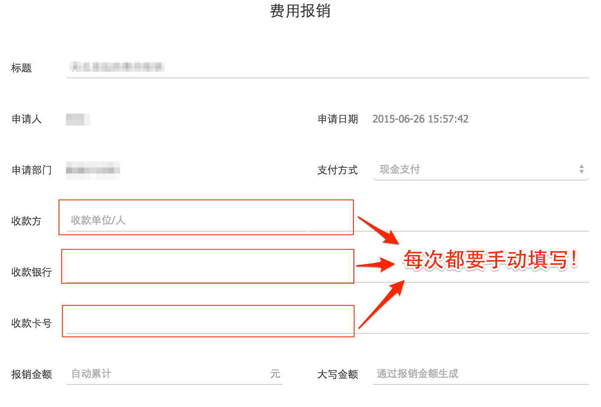

明道OA助手
===

为什么要有明道OA助手？

通过上图大家应该就知道了，每次填写报销单时都需要*手动*填写上图中红框标注的那些信息，而且没有历史记忆功能，实在是不能忍受。

明道OA助手就是为了解决这个问题开发的，只需填写一次账号信息，下次直接选择即可。

安装
===

1. 先在Chrome中打开chrome://extensions/, 打开开发者模式，如下图
2. 然后下载[mingdao.ext.crx](https://github.com/jiacai2050/mingdao.ext/raw/master/mingdao.ext.crx)
3. 最后把刚才下载的mingdao.ext.crx文件拖到Chrome上就可以安装了。

使用
===

1. 点击明道OA助手图标，点击“添加新账号”
2. 填写“收款人”、“收款银行”、“银行卡号”信息
3. 去[明道OA](http://oa.mingdao.com/platform/desktop)添加报销单，刚才添加的账号信息会自动出现在该页面中。
